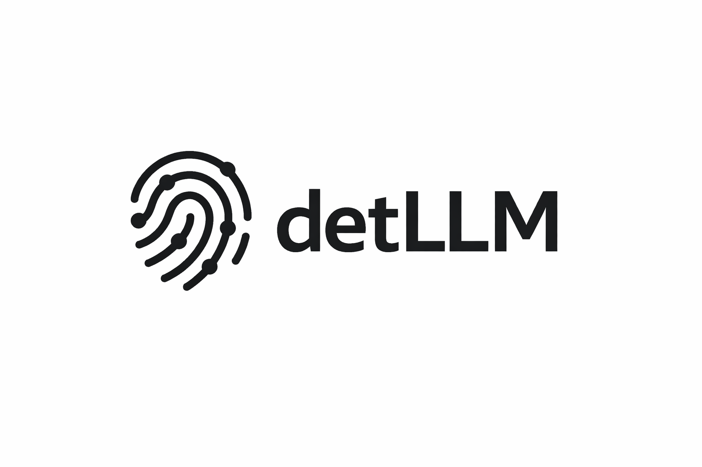

<p align="center">
  
</p>

# detLLM

[](https://github.com/tommasocerruti/detllm/actions/workflows/ci.yml)
[](LICENSE)
detLLM helps you verify whether an LLM inference setup is reproducible and gives you a minimal repro pack when it is not.

detLLM measures variance across repeated runs and across batch sizes, and explains divergences without overpromising.

## Known limitations

- GPU determinism is conditional; results can change across drivers/kernels.
- Batch invariance is not guaranteed; it is measured separately.
- Strict guarantees depend on backend capabilities.
- Distributed/multiprocess inference is out of scope for now.

## Quickstart

```bash
pip install -e .
detllm check --backend hf --model <model_id> --prompt "Hello" --tier 1 --runs 5 --batch-size 1
```

Note: some shells (like zsh) require quotes when installing extras, e.g. `pip install -e '.[test]'`.

## Verification

See [docs/verification.md](docs/verification.md) for the full local verification procedure and expected outputs.

## Tiers

- Tier 0: artifacts + deterministic diff/report (no equality guarantees)
- Tier 1: repeatability across runs for a fixed batch size
- Tier 2: Tier 1 + score/logprob equality (capability-gated)

Tier 1 guarantees repeatability only for a fixed batch size; batch invariance is measured separately.

Tier 2 scores are captured when the backend supports stable score/logprob output. See `docs/verification.md` for how to verify scores appear in traces.

## Artifacts (minimal repro pack)

Each run writes an `artifacts/<run_id>/` folder:

- `env.json`
- `run_config.json`
- `determinism_applied.json`
- `trace.jsonl`
- `report.json` + `report.txt`
- `diffs/first_divergence.json`

## Python API

```python
from detllm import check, run

run(
    backend="hf",
    model="distilgpt2",
    prompts=["Hello"],
    tier=1,
    out_dir="artifacts/run1",
)

report = check(
    backend="hf",
    model="distilgpt2",
    prompts=["Hello"],
    runs=3,
    batch_size=1,
    out_dir="artifacts/check1",
)

print(report.status, report.category)
```

## CLI

- `detllm env`
- `detllm run`
- `detllm check`
- `detllm diff`
- `detllm report`

## Docs

- [docs/verification.md](docs/verification.md)
- [docs/determinism_boundary.md](docs/determinism_boundary.md)
- [docs/troubleshooting.md](docs/troubleshooting.md)
- [docs/vllm.md](docs/vllm.md)
- [docs/python_api.md](docs/python_api.md)
- [docs/versioning.md](docs/versioning.md)

## Versioning

See [docs/versioning.md](docs/versioning.md) for compatibility guarantees.
